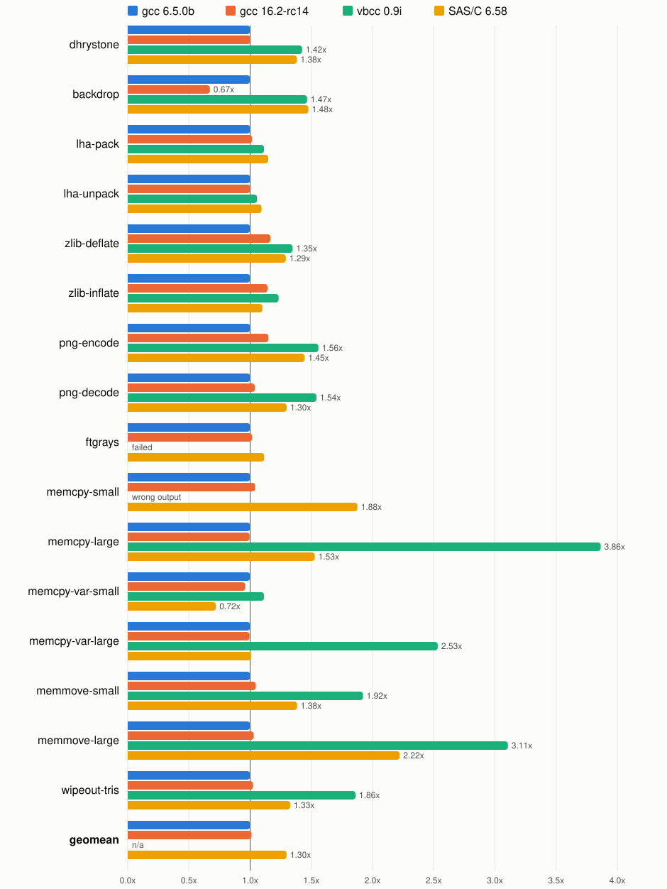

# Results

Fastest iteration in milliseconds under volamos[^volamos].
The cycle count makes all iterations identical.
Percentages are against the first column.

## Release binaries, m68k-amigaos-gcc 16.2-rc14[^gcc]

Benchwork[^benchwork], built with `make release`.

| benchmark | 000 | 020 | 040 |
|---|---:|---:|---:|
| dhrystone | 452 | 420 (-7.07%) | 421 (-6.90%) |
| backdrop | 9805 | 1978 (-79.82%) | 1941 (-80.20%) |
| lha-pack | 4981 | 4517 (-9.32%) | 4441 (-10.84%) |
| lha-unpack | 1450 | 1389 (-4.21%) | 1379 (-4.93%) |
| zlib-deflate | 3899 | 3736 (-4.17%) | 3698 (-5.14%) |
| zlib-inflate | 526 | 481 (-8.50%) | 511 (-2.86%) |
| png-encode | 7905 | 7733 (-2.16%) | 7543 (-4.57%) |
| png-decode | 1893 | 1602 (-15.39%) | 1587 (-16.18%) |
| ftgrays | 1477 | 864 (-41.47%) | 858 (-41.87%) |
| memcpy-small | 452 | 202 (-55.19%) | 193 (-57.23%) |
| memcpy-large | 740 | 327 (-55.80%) | 326 (-55.90%) |
| memcpy-var-small | 587 | 565 (-3.75%) | 565 (-3.75%) |
| memcpy-var-large | 647 | 634 (-2.11%) | 635 (-1.93%) |
| memmove-small | 2362 | 2351 (-0.44%) | 2351 (-0.44%) |
| memmove-large | 4137 | 4127 (-0.25%) | 4127 (-0.25%) |
| wipeout-tris[^softfloat] | 879 | 810 (-7.89%) | 519 (-41.00%) |
| **GEOMEAN** | **1585** | **1201 (-24.23%)** | **1162 (-26.68%)** |

## m68k compiler comparison

All runs done with benchwork-040 built with `-O2 -fomit-frame-pointer -m68040
-m68881`, or the equivalent for vbcc and SAS/C. Each compiler links its own
C library, so the memcpy and memmove rows compare the compiler together with
its runtime.

### Time relative to gcc 6.5.0b

Each bar is the compiler's time divided by gcc 6.5.0b's, so shorter is
faster and gcc 6.5.0b sits at 1.0. Bars more than 25% away from it carry
their ratio.

### Milliseconds

The fastest cell of each row is in bold.

| benchmark | 6.5.0b | 16.2-rc14 | vbcc 0.9i[^vbcc] | SAS/C 6.58[^sasc] |
|---|---:|---:|---:|---:|
| dhrystone | **420** | 421 (+0.26%) | 599 (+42.49%) | 581 (+38.21%) |
| backdrop | 2891 | **1941 (-32.87%)** | 4238 (+46.57%) | 4267 (+47.57%) |
| lha-pack | **4375** | 4441 (+1.49%) | 4870 (+11.30%) | 5022 (+14.77%) |
| lha-unpack | **1378** | 1379 (+0.05%) | 1457 (+5.71%) | 1507 (+9.32%) |
| zlib-deflate | **3172** | 3698 (+16.59%) | 4274 (+34.75%) | 4096 (+29.13%) |
| zlib-inflate | **447** | 511 (+14.21%) | 551 (+23.32%) | 492 (+10.05%) |
| png-encode | **6562** | 7543 (+14.95%) | 10221 (+55.76%) | 9483 (+44.51%) |
| png-decode | **1529** | 1587 (+3.82%) | 2357 (+54.21%) | 1985 (+29.87%) |
| ftgrays | **845** | 858 (+1.56%) | failed | 942 (+11.48%) |
| memcpy-small | **186** | 193 (+4.14%) | wrong output | 348 (+87.63%) |
| memcpy-large | 328 | **326 (-0.44%)** | 1267 (+286.43%) | 501 (+52.81%) |
| memcpy-var-small | 588 | 565 (-3.92%) | 654 (+11.34%) | **423 (-27.94%)** |
| memcpy-var-large | 638 | **635 (-0.52%)** | 1616 (+153.27%) | 644 (+0.92%) |
| memmove-small | **2247** | 2351 (+4.61%) | 4320 (+92.22%) | 3110 (+38.40%) |
| memmove-large | **4011** | 4127 (+2.89%) | 12458 (+210.62%) | 8911 (+122.20%) |
| wipeout-tris | **507** | 519 (+2.38%) | 943 (+86.08%) | 672 (+32.73%) |
| **GEOMEAN** | **1149** | **1162 (+1.17%)** | | **1491 (+29.78%)** |

[^volamos]: volamos 0.8.0, `volamos --clock-mhz 25 --cpu 68040 --fpu <binary> -n 1`
    for every column. The emulated time is derived from the CPU's cycle count
    at 25 MHz; native library calls cost no cycles. The geomean is computed
    from the rows by `tools/results-table.py`, not taken from the binary.
[^gcc]: `m68k-amigaos-gcc (AmigaDev v16.2-rc14) 16.2.0b 20260825082934`,
    the AmigaPorts 16.2-rc14 release, with its default newlib runtime. 6.5.0b
    is `m68k-amigaos-gcc (GCC) 6.5.0b 20260819091705`, also with newlib. The
    040 build says `-m68881` rather than its synonym `-mhard-float` because
    only the former selects the hard-float multilib in rc14.
[^vbcc]: `vbcc V0.9i pre` from the same toolchain, `make vbcc-release`:
    `vc +aos68k -O2 -cpu=68040 -fpu=68040` with vc.lib, m040.lib and
    amiga.lib. vbcc 0.9i miscompiles two of the drivers: ftgrays fails
    before it runs, and memcpy-small produces a wrong checksum and writes
    outside its buffers, which is why no geomean is given.
[^sasc]: SAS/C 6.58, `make sasc-release`: `CPU=68040 MATH=68881` with
    `OPTIMIZE OPTIMIZERTIME OPTIMIZERINLINELOCAL OPTIMIZERSCHEDULER` and the
    optimizer depths at 8, `PARAMETERS=REGISTERS CODE=FAR DATA=FAR`, linked
    with scm040.lib, sc.lib and amiga.lib.
[^benchwork]: Benchwork 1.2 plus the switch to each compiler's own C library.
[^softfloat]: The 000 and 020 builds are soft float, and newlib's float
    arithmetic is a stub into the mathieeesingbas ROM library, which volamos
    runs natively at zero cycles: 370,000 calls in wipeout-tris. Those two
    columns measure everything in the benchmark except its float math.
